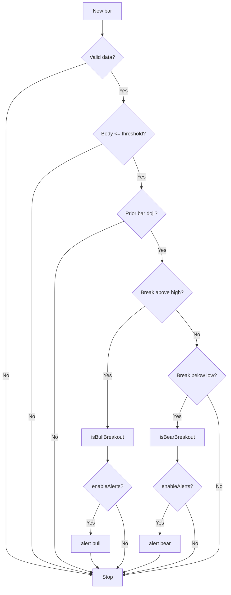

# Alert Flow Overview

© 2025 Bulldog Ventures Inc. All rights reserved.

This diagram illustrates how the `WTT_Compression` indicator detects a doji, confirms breakout direction, and fires alerts when enabled.

